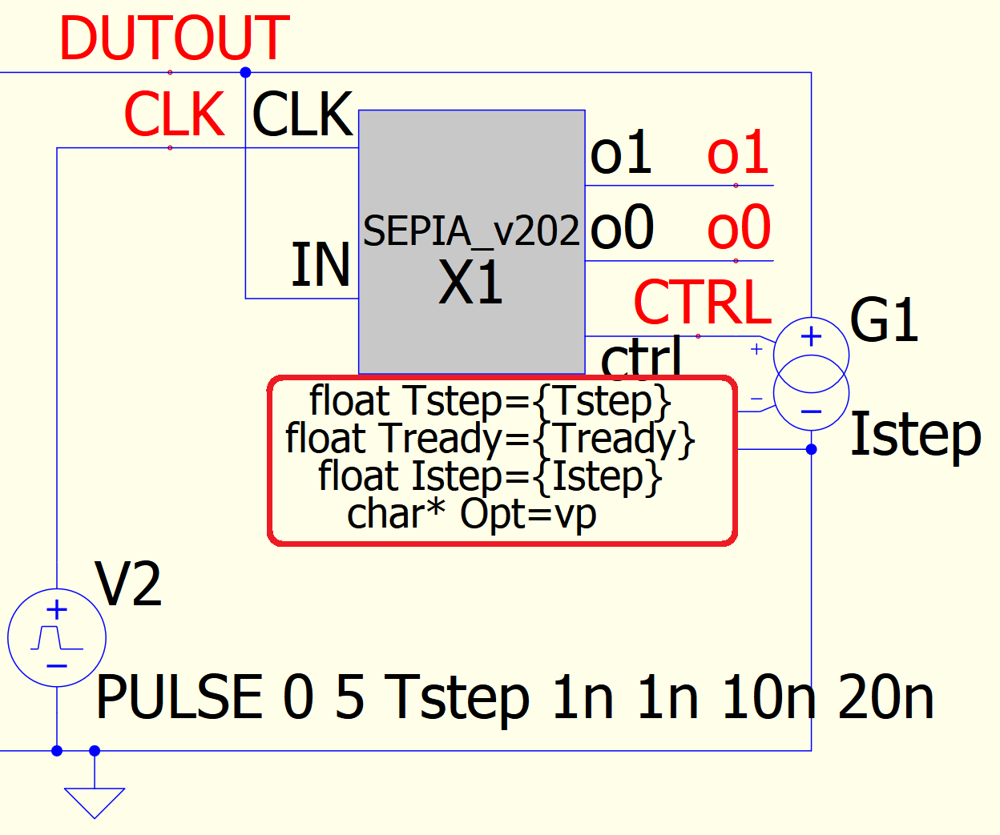

# SEPIA@QSPICE Module Parameters / Options

You can pass on your expected behavior options to the SEPIA@QSPICE module as a sub-circuit parameter of QSPICE simulator in the way of the screen capture.

We can see four (4) parameters, in the red-box, are defined for this block.

NOTE that parameter values **{Tstep}**, **{Tready}** and **{Istep}** are all defined as QSPICE simulation parameters like this:
````
.param Tstep = 1m
.param Tready = 0.8m
.param Istep = -1
````
But you can directly pass on numbers without using **.param** statements



## Load-Step Parameters

### Parameter #1:  Step-load Timing

The 1st parameter is a floating number specifys the time point of step-event.
At the given timing, the SEPIA@QSPICE block drives its "ctrl" output port from L to H.

### Parameter #2:  Pre-Step Steady-State Timing

The 2nd parameter is a floating number specifys the time point where the DUT system is in steady-state so that the SEPIA@QSPICE block starts detecting / averaing its pre-step voltage reference value.

### Parameter #3:  Step-load Amplitude

The 3rd parameter is a floating number specifys the step-load current amplitude.  
This parameter is to calculate impedance of V = R x I.

A negative ( "< 0A" ) number means a current flow "sinking" from the DUT.
The expected use is well explained by the "G1" voltage-controlled-current-source element in this screen capture (above).

***
***

## Parameter #4:  SEPIA@QSPICE Options

The SEPIA@QSPICE module analyzes a TEXT string of option parameters.  
Following options can be specified in any order but case sensitive.  
Between multiple options, **DO NOT** insert any comma or space.

***
***
### One-Letter Options

#### **x** Option
When you have no option to activate from in this list, please use this **x** option.  
This is a one-letter option.
````
char* Opt=x
````
***
#### **p** Option
The **p** option triggers to output detected peak information details.  
This is a one-letter option.
````
char* Opt=p
````
***
#### **v** Option
The **v** option triggers to output operation detail in a verbose manner.  
This is a one-letter option.
````
char* Opt=v
````
***
***
### **l** Option (Lower-case L, for "log")
The **l** option triggers to output its logging information into a file.
This is a multi-letter option, that must follow this syntax.

#### **l:** or **l/**
These 2 forms are the same and the module automatically assign a log file name.
Note both letters **":"** and **"/"** can't be used in a regular Windows filename and we use them as our delimiter.
````
char* Opt=l:
````
or
````
char* Opt=l/
````

#### **l_file_name_:** or **l_file_name_/**
These 2 forms are the same and the module outputs its logging information into the filename specified.
The ***\_file_name_*** can be anything sandwiched between **"l"** and **": or /"**.
````
char* Opt=l_file_name_:
````
or
````
char* Opt=l_file_name_/
````
***
***
### **t** Option
The **t** option triggers to output its transient model with extracted parameters into a file.  
It can also control if the module run a follow-up simulation by using the extracted model or not.
This is a multi-letter option, that must follow this syntax.
***
#### ***Model-0 Transient Option***
You can pick one of following 4 options.  
The module has only one routing to execute an option starting **t0...**.

##### **t0:**
The module generates **model-0** of transient model based on the extracted parameters, into an automatically generated filename.
````
char* Opt=t0:
````
##### **t0/**
The module generates **model-0** of transient model based on the extracted parameters, into an automatically generated filename.  
Then, it automatically runs a simulation on the transient model file.  You will have a waveform viewer open.
````
char* Opt=t0/
````
##### **t0_file_name_:**
The module generates **model-0** of transient model based on the extracted parameters, into the filename specified.
````
char* Opt=t0_file_name_:
````
##### **t0_file_name/**
The module generates **model-0** of transient model based on the extracted parameters, into the filename specified.  
Then, it automatically runs a simulation on the transient model file.  You will have a waveform viewer open.
````
char* Opt=t0_file_name_/
````
***
#### ***Model-1 Transient Option***
You can pick one of following 4 options.  
The module has only one routing to execute an option starting **t1...**.

##### **t1:**
The module generates **model-1** of transient model based on the extracted parameters, into an automatically generated filename.
````
char* Opt=t1:
````
##### **t1/**
The module generates **model-1** of transient model based on the extracted parameters, into an automatically generated filename.  
Then, it automatically runs a simulation on the transient model file.  You will have a waveform viewer open.
````
char* Opt=t1/
````
##### **t1_file_name_:**
The module generates **model-1** of transient model based on the extracted parameters, into the filename specified.
````
char* Opt=t1_file_name_:
````
##### **t1/**
The module generates **model-1** of transient model based on the extracted parameters, into the filename specified.  
Then, it automatically runs a simulation on the transient model file.  You will have a waveform viewer open.
````
char* Opt=t1_file_name_/
````
***
***
### **a** Option
The **a** option triggers to output its AC model with extracted parameters into a file.  
It can also control if the module run a follow-up simulation by using the extracted model or not.
This is a multi-letter option, that must follow this syntax.

#### ***Model-0 AC Option***
You can pick one of following 4 options.  
The module has only one routing to execute an option starting **a0...**.

##### **a0:**
The module generates **model-0** of AC model based on the extracted parameters, into an automatically generated filename.
````
char* Opt=a0:
````
##### **a0/**
The module generates **model-0** of AC model based on the extracted parameters, into an automatically generated filename.  
Then, it automatically runs a simulation on the transient model file.  You will have a waveform viewer open.
````
char* Opt=a0/
````
##### **a0_file_name_:**
The module generates **model-0** of AC model based on the extracted parameters, into the filename specified.
````
char* Opt=a0_file_name_:
````
##### **a0_file_name/**
The module generates **model-0** of AC model based on the extracted parameters, into the filename specified.  
Then, it automatically runs a simulation on the transient model file.  You will have a waveform viewer open.
````
char* Opt=a0_file_name_/
````
***
#### ***Model-1 AC Option***
You can pick one of following 4 options.  
The module has only one routing to execute an option starting **a1...**.

##### **a1:**
The module generates **model-1** of AC model based on the extracted parameters, into an automatically generated filename.
````
char* Opt=a1:
````
##### **a1/**
The module generates **model-1** of AC model based on the extracted parameters, into an automatically generated filename.  
Then, it automatically runs a simulation on the transient model file.  You will have a waveform viewer open.
````
char* Opt=a1/
````
##### **a1_file_name_:**
The module generates **model-1** of AC model based on the extracted parameters, into the filename specified.
````
char* Opt=a1_file_name_:
````
##### **a1/**
The module generates **model-1** of AC model based on the extracted parameters, into the filename specified.  
Then, it automatically runs a simulation on the transient model file.  You will have a waveform viewer open.
````
char* Opt=a1_file_name_/
````


## Example of Complex Option String

This is an example of valid option string.
````
char* Opt=pvl_sepia_log:t1_sepia_tran/a0_sepia_ac:
````
In this example, we specify following options all together.

* **p** option for peak info
* **v** option for verbose output
* **l** option to output into the file named "_sepia_log"
* **t1** option to output the **model-1** transient model into the file named "_sepia_tran" **AND** automatically execute a simulation on this "_sepia_tran" model.
* **a0** option to output the **model-0** AC model into the file named "_sepia_ac" but no automatic simulation.  (A user can run a simulation manually, later on.)

